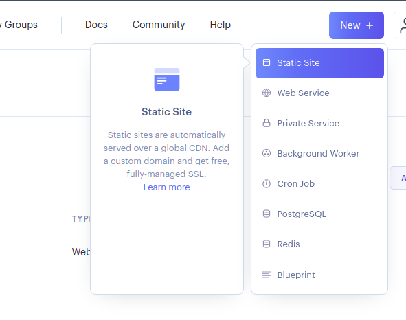
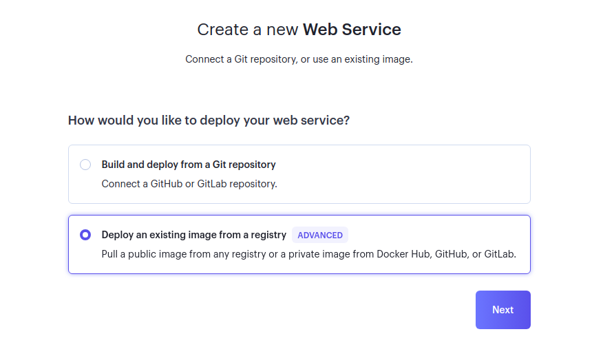
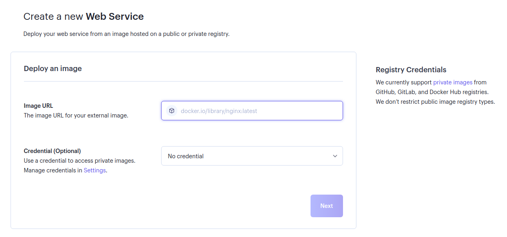
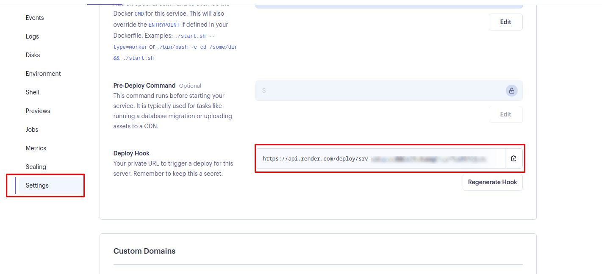
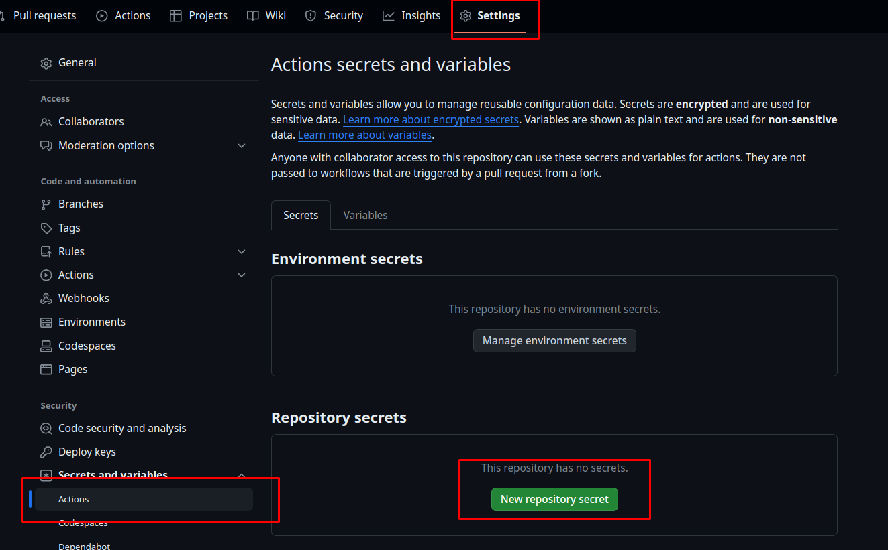
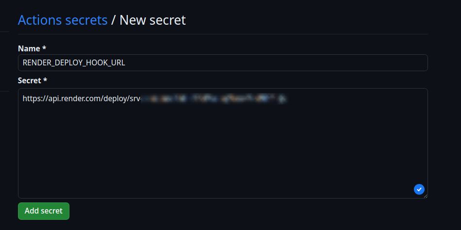

# Comment déployer sur render.com via Github Action

## 2 Créez un nouveau dépôt sur Github

Lors de la création de votre projet sur Github, vous devez respecter la structure suivante pour votre projet:

```
votre_projet/
    | - .github/
    |   | - workflows/      # Dossier contenant les actions Github
    |   |   | - build.yml   # Fichier de configuration de l'action Github
    | - backend/           # Dossier contenant le code backend
    |   | * Votre code backend *
    | - docker/           # Dossier contenant les fichiers de configuration
                          # à intégrer dans docker
    |   | - nginx.conf          # Fichier de configuration de nginx
    |   | - supervisord.conf    # Fichier de configuration de supervisord
    | - frontend/         # Dossier contenant le code frontend
    |   | * Votre code frontend Angular *
    | - .dockerignore   # Fichier contenant les fichiers à ignorer lors du build
    | - Dockerfile      # Fichier de configuration de docker
```

Vous devrez copier les fichiers suivants dans votre projet pour pouvoir déployer sur render.com:

- [.github/workflows/build.yml](./.github/workflows/build.yml)
- [Dockerfile](./Dockerfile)
- [.dockerignore](./.dockerignore)
- [docker/nginx.conf](./docker/nginx.conf)
- [docker/supervisord.conf](./docker/supervisord.conf)

## 3. Créez un nouveau dépôt sur render.com

Ensuite, rendez vous sur [render.com](https://dashboard.render.com/) et créez un nouveau dépôt comme suit :




Sur l'écran suivant, vous devrez passer une URL au format `docker pull ghcr.io/pseudo_github/nom_du_depot:latest` dans le champ `Image URL`:



À partir de là, render devrait pouvoir déployer votre image tout seul.

## 4. Dire à Github de prévenir Render quand une nouvelle image est disponible

Tout d'abord, aller dans `Settings` > `Deploy hook` :



Vous aller copier ce lien pour l'ajouter à Github.



Collez votre URL dans le secret puis validez.


Et voilà ! Votre projet va pouvoir se déployer sur render.com !

Dès que vous pousserez du code dans la branche `main`, Github va lancer l'action `build.yml` qui va construire une nouvelle image docker et la pousser sur Github Container Registry. Une fois l'image poussée, Github va envoyer une notification à render.com qui va récupérer l'image et la déployer.
